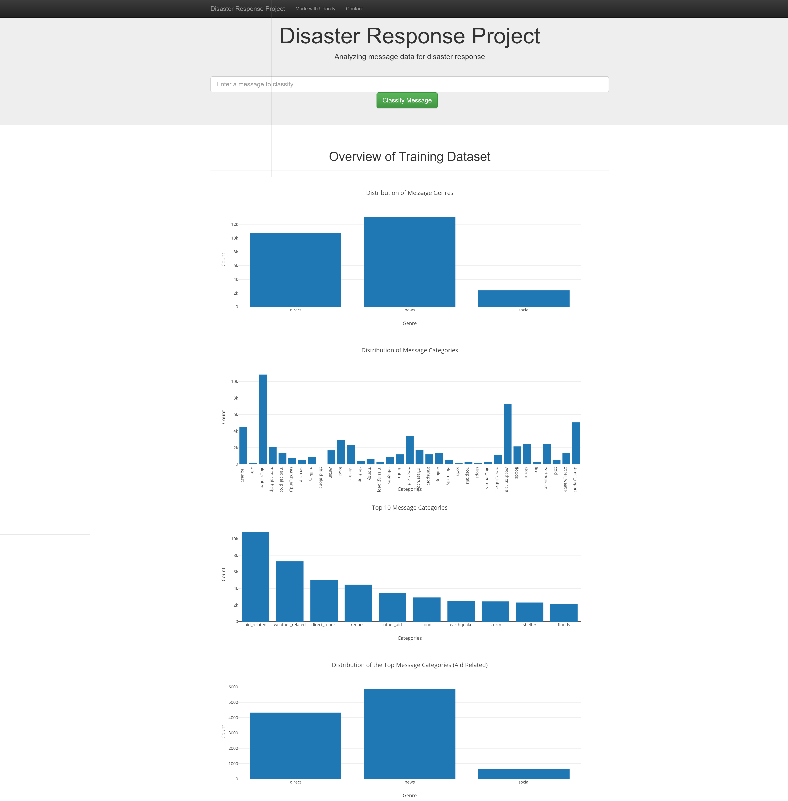
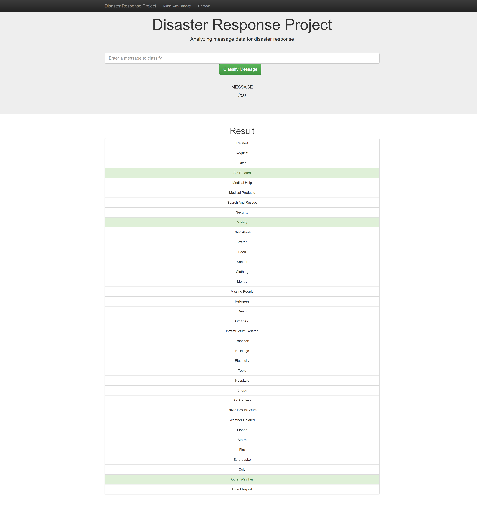

# Disaster Response Pipeline Project

### Project Overview :

In this project, it will provide a disaster reponse to analyze disaster data from Figure Eight to build a model for an API that classifies disaster messages.

This project includes a web app where an emergency worker can input a new message and get classification results in several categories. The web app will also display visualizations of the data.

### File Structure :

- app
> - template
| > - master.html  # main page of web app
| > - go.html  # classification result page of web app
|- run.py  # Flask file that runs app

- data
|- disaster_categories.csv  # data to process 
|- disaster_messages.csv  # data to process
|- process_data.py
|- InsertDatabaseName.db   # database to save clean data to

- models
|- train_classifier.py
|- classifier.pkl  # saved model 

- ETL Pipeline Preparation.ipynb # Notebook file
- ML Pipeline Preparation.ipynb  # Notebook file

- README.md

- screenshot1.png # PNG file
- screenshot2.png # PNG file

Below are a few screenshots of the web app.

 

### Instructions:
1. Run the following commands in the project's root directory to set up your database and model.

    - To run ETL pipeline that cleans data and stores in database
        `python data/process_data.py data/disaster_messages.csv data/disaster_categories.csv data/DisasterResponse.db`
    - To run ML pipeline that trains classifier and saves
        `python models/train_classifier.py data/DisasterResponse.db models/classifier.pkl`

2. Run the following command in the app's directory to run your web app.
    `python run.py`

3. Go to http://0.0.0.0:3001/
